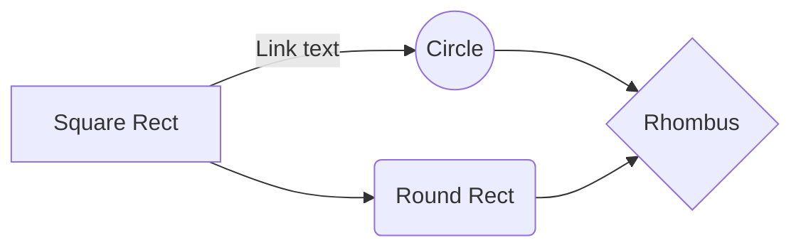

# Hands on iceberg query performance

This project measures and analyzes query performance on Apache Iceberg tables with different data characteristics and query patterns. It provides comprehensive benchmarking tools to evaluate how various factors like table size, data distribution, and query complexity affect performance.

The project includes a complete Docker Compose environment with Trino and MinIO, automated data generation with configurable schemas, and detailed performance reporting with statistical analysis.

## What it measures

The benchmarking suite evaluates:
- **Count queries** with various filter conditions
- **Pagination queries** (first page, deep pagination, sorted vs unsorted)
- **Aggregation queries** with GROUP BY operations
- **Multi-table joins** and complex queries
- **Concurrency simulation** with parallel query streams
- **Statistical analysis** including percentiles, averages, and performance distributions

## Important Disclaimer

⚠️ **Performance measurements are hardware-dependent**: The query performance results obtained from this benchmarking suite are highly dependent on your specific hardware configuration, including CPU, memory, storage type (SSD vs HDD), and available resources. 

The measurements provided should be considered as **reference values** for relative comparison between different query types and configurations, rather than absolute performance benchmarks. For production planning, always test on hardware that closely matches your target environment.

## Reference measures

### Pagination

When testing pagination performance, the main focus areas are:

- **Count queries**: Essential for building pagination UI components that need to know total record counts and calculate page numbers
- **First page retrieval**: Measuring performance of `LIMIT` queries without `OFFSET` to establish baseline pagination speed
- **Deep pagination**: Testing `OFFSET` queries for accessing pages far into the dataset (e.g., 100th page), which typically shows performance degradation
- **Sorted vs unsorted pagination**: Comparing performance between ordered and unordered result sets, as sorting adds computational overhead
- **Concurrent query execution**: Understanding how pagination performance degrades when multiple users execute queries simultaneously vs single-user scenarios

#### Performance Measurements

On a 100M row table, count requests and pagination (1st and 100th page) without sorting take less than a second. With sorting, it may take 2-3 seconds for both the first and 100th page. Adding filters that narrow the files to scan can help significantly - for example, using `id > 50_000_000`. The 100th page with sorting and an "amount > 1000" filter takes 11 seconds on a 1B row table, but only 6 seconds with the combined filter "amount > 1000 AND id > 500_000_000".

**Query Contention**

With 30 parallel requests running against the same table, performance doesn't seem to be significantly affected on a 100M row table. However, when queries compete for resources, execution time can increase by up to three times.

**Scaling with Row Count:**

With 1B rows, pagination performance increases to 6-10 seconds, becoming three times slower when the row count increases by 10 times.

Running queries on wide tables increases execution time by approximately twice.

## Commands

* Start environment `yarn compose:up`
* Define your schema: `src/config/tableConfig.ts`
* Generate data: `yarn generate`
* Test query performance: `yarn query`
* Lint code: `yarn lint` (TypeScript type checking) or `yarn lint:fix` (ESLint with auto-fix)
* Stop environment with volumes deletion: `yarn compose:reset`
* Del environments and restart from scratch: `yarn compose:reset && yarn compose:up && sleep 5 && yarn generate`

## Docker Compose via yarn scripts

You can manage the stack using convenient yarn scripts (wrapping `docker compose`):

* Start: `yarn compose:up`
* Stop: `yarn compose:down`
* Restart: `yarn compose:restart`
* Logs (follow): `yarn compose:logs`
* Status: `yarn compose:ps`
* Clean teardown (remove volumes/orphans): `yarn compose:reset`
* Execute in container: `yarn compose:exec -it trino trino`
* Base command: `yarn compose:base` (for custom docker compose commands)

# Start environment
```sh
yarn compose:up
```

## Dashboards / endpoints

* Trino: http://localhost:8080
* MinIO console: http://localhost:9001 (user/pass from env)

# Working with iceberg through Trino
* Enter trino console in container: `yarn compose:exec -it trino trino`
* Check Trino works: `SELECT 1;`
* Check Trino node version: `SELECT node_version FROM system.runtime.nodes;`
* `SHOW CATALOGS;`
* `CREATE SCHEMA IF NOT EXISTS iceberg.experiment_schema;`
* `SHOW SCHEMAS FROM iceberg;`
* `CREATE TABLE IF NOT EXISTS iceberg.experiment_schema.experiment_table (id bigint);`
* `SHOW TABLES FROM iceberg.experiment_schema;`
* `SHOW TABLES FROM iceberg.lab;`
* `SHOW CREATE TABLE iceberg.experiment_schema.experiment_table;`
* `INSERT INTO iceberg.experiment_schema.experiment_table VALUES (1);`
* `SELECT * FROM iceberg.experiment_schema.experiment_table;`
* Set simple property: `ALTER TABLE iceberg.experiment_schema.experiment_table SET PROPERTIES format = 'PARQUET';`
* Set compression-codec property through extra_properties: `ALTER TABLE iceberg.experiment_schema.experiment_table SET PROPERTIES extra_properties = map_from_entries(ARRAY[ROW('write.parquet.compression-codec', 'zstd')]);`
* Set compression-level property through extra_properties: `ALTER TABLE iceberg.experiment_schema.experiment_table SET PROPERTIES extra_properties = map_from_entries(ARRAY[ROW('write.parquet.compression-level', '9')]);`
* Show properties of a table: `SELECT * FROM iceberg.experiment_schema."experiment_table$properties";`
* Create table with compression props set through extra_properties `CREATE TABLE IF NOT EXISTS iceberg.experiment_schema.experiment_table_2 (id bigint) WITH (extra_properties = map_from_entries(ARRAY[ROW('write.parquet.compression-codec', 'zstd'), ROW('write.parquet.compression-level', '9')]));`
* Show table props: `SELECT * FROM iceberg.experiment_schema."experiment_table$properties";`
* Show table props: `SELECT * FROM iceberg.experiment_schema."experiment_table_2$properties";`
* Show table props: `SELECT * FROM iceberg.lab."events_zstd_l01$properties";`
* Optimize: `CALL iceberg.system.optimize('lab.events_zstd_l06');`
ALTER TABLE iceberg.lab.events_zstd_l06 EXECUTE optimize;

## Troubleshooting

* Down with volume remove: `yarn compose:reset`
* All logs: `yarn compose:logs`
* Service logs: `yarn compose:base logs [service]`
* Last 10 log lines: `yarn compose:base logs [service] | tail -10`
* Logs of the container: `yarn compose:base logs trino`
* Force recreate container: `yarn compose:up --force-recreate trino`
* Check iceberg.properties inside Trino: `yarn compose:exec -it trino sh -lc 'grep -n "allowed-extra" -n /etc/trino/catalog/iceberg.properties; echo; cat /etc/trino/catalog/iceberg.properties'`
* Check Trino session catalog: `yarn compose:exec -it trino trino --execute "SHOW CATALOGS"`
* Show tables in iceberg schema: `yarn compose:exec -it trino trino --execute "SHOW TABLES FROM iceberg.lab"`
* Try to create trino iceberg catalog manually with compression: ```
yarn compose:exec -it trino trino --execute "
CREATE SCHEMA IF NOT EXISTS iceberg.lab;
CREATE TABLE IF NOT EXISTS iceberg.lab._prop_test (id bigint)
WITH (
  \"write.parquet.compression-codec\" = 'zstd'
)"```
* Check Trino node version: `yarn compose:exec -it trino trino --execute "SELECT node_version FROM system.runtime.nodes"`
* Check table properties: `yarn compose:exec -it trino trino --execute "SHOW CREATE TABLE iceberg.lab.events_base"`

WITH (partitioning = ARRAY['month(order_date)', 'bucket(account_number, 10)', 'country']);
WITH (sorted_by = ARRAY['order_date']);

# Development

* Type check: `yarn lint`
* Lint and fix: `yarn lint:fix`
* Format code: `yarn format`
* Check formatting: `yarn format:check`

# Generate data and run performance tests

* Generate test data: `yarn generate`
* Run query performance benchmarks: `yarn query`

## Algorithms
You need [Mermaid Preview](https://marketplace.visualstudio.com/items?itemName=vstirbu.vscode-mermaid-preview) extension to see gparhs in [vsc](https://code.visualstudio.com/)

### Example graph

